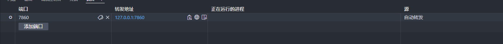

# SummerStudy1
************笔记仓库，书生大模型暑期训练营：[仓库链接](https://github.com/InternLM/Tutorial)***********

## 2024/7/15

## 一.linux

### 1.SSH远程连接+端口映射

使用vscode远程连接成功

### 2.添加端口映射后，可以访问

## 二.git
### 1.破冰任务

提交完成，正在审核

### 2.构建自己的项目

## 三.python

### 1.wordcount代码

代码中使用了re 模块来处理正则表达式，定义单词的正则表达式，并在输入的字符串中提取出来。
     使用了defaultdict字典来存储单词及其出现的次数。

### 2.单步调试：

text原始输入：

小写，去除标点

遍历字典，计数

最终输出

